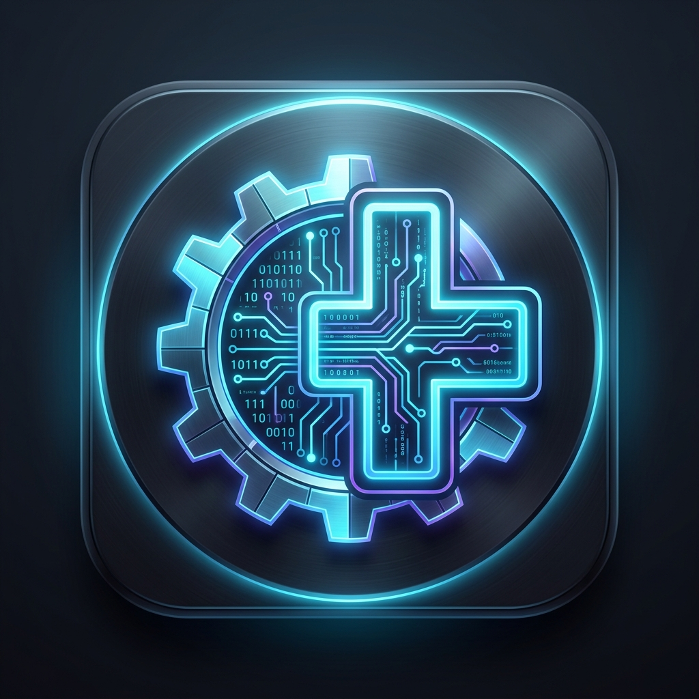

<p align="center">
  
</p>

# BCL Porting & Mod Crash Assistant (BCL Tool App)

[](https://dotnet.microsoft.com/)
[](https://avaloniaui.net/)
[](#-검증-및-테스트)

Unity 게임 모딩(MelonLoader, BepInEx 등) 시 Unity의 **관리 코드 스트리핑(Managed Code Stripping)**으로 인해 발생하는 BCL(Base Class Library: `mscorlib.dll`, `System.Core.dll` 등) 결손 및 모드로더 부트스트랩 실패/크래시를 오프라인에서 안전하게 탐지, 진단, 복구(이식)하는 크로스플랫폼 GUI 데스크톱 도구입니다.

---

## 🌟 주요 특징

- **순수 정적 분석 (`Mono.Cecil`)**: 게임 바이너리를 직접 실행하지 않고 PE 어셈블리 메타데이터, 타입, 메서드 시그니처를 오프라인에서 안전하게 검사합니다.
- **SHA-256 무결성 및 원자적 롤백**: 파일 이식 시 원본 파일 해시 기반 백업(`.bcl-backup.json`)을 자동 생성하며, 검증 실패 시 즉시 자동 롤백합니다.
- **반응형 모던 데스크톱 UI**: Avalonia UI 11 + CommunityToolkit.Mvvm 기반의 가볍고 직관적인 인터페이스를 제공합니다.

---

## 🛠️ 핵심 기능 (4대 모듈)

### 1. 🔍 스트리핑 게임 자동 감지 (`Game Discovery & Stripping Detector`)
- Steam 라이브러리(`libraryfolders.vdf`, Windows 레지스트리)를 스캔하여 설치된 Unity Mono 게임을 자동 탐색합니다.
- `mscorlib.dll`과 `System.Core.dll`의 **14개 표본 API**(Activator, Reflection, DynamicMethod, ILGenerator, LINQ, Expression 등)의 존재 여부를 Cecil로 정적 검사하여 스트리핑 의심 게임을 선별합니다.
- 메서드 이름뿐 아니라 제네릭 인자 수와 매개변수 타입 시그니처까지 대조하여 특정 오버로드만 삭제된 경우도 정확히 감지합니다.

### 2. 🩺 크래시 로그 진단기 (`Crash Log Analyzer`)
- MelonLoader(`Latest.log`), BepInEx(`LogOutput.log`), Unity `Player.log`의 스택트레이스를 파싱합니다.
- BCL 결손(`MissingMethodException`, `TypeLoadException`, `FileNotFoundException`), 엔진 내부 icall, 모드로더 부트스트랩 실패, 런타임 프로파일(.NET 2.0 vs .NET 4.6+) 불일치를 자동 분류하고 맞춤형 해결 가이드를 제공합니다.

### 3. ⚖️ 어셈블리 비교 도구 (`Assembly Diff Inspector`)
- 대상 게임(Target)과 온전한 BCL을 가진 기증 게임(Donor)의 `Managed` 디렉터리 내 DLL 목록, 파일 크기, SHA-256 해시, 버전 차이를 테이블 형태로 시각화합니다.
- 타입/메서드 시그니처 심볼 검색을 지원하여 특정 API가 양쪽 어셈블리에 존재하는지 즉시 대조할 수 있습니다.

### 4. 🛡️ 안전 이식 및 복원 (`Safe Transplant & Restore`)
- 기증 게임의 정상 BCL DLL을 대상 게임에 안전하게 복사/이식합니다.
- 이식 전 대상 게임의 원본 상태를 메타데이터와 함께 자동 백업합니다.
- 이식 과정 중 오류 발생 시 즉시 이전 상태로 자동 롤백하며, 원클릭으로 원본 복원이 가능합니다.
- 사후 스팀 업데이트된 게임 코드(`Assembly-CSharp.dll` 등)나 무관한 파일의 변경 사항을 훼손하지 않고 이식된 대상만 선별 복원합니다.

---

## 🧱 기술 스택 및 아키텍처

| 구성 요소 | 기술 스택 | 설명 |
|---|---|---|
| **런타임 프레임워크** | **.NET 8 (LTS)** | 고성능 파일 I/O 및 최신 C# 언어 기능 활용 |
| **UI 프레임워크** | **Avalonia UI 11** | 크로스플랫폼 XAML 데스크톱 UI (Fluent Theme) |
| **MVVM 패턴** | **CommunityToolkit.Mvvm** | `[ObservableProperty]`, `[RelayCommand]` 기반 클린 아키텍처 |
| **정적 분석 엔진** | **Mono.Cecil 0.11.5** | 게임 실행 없는 PE 어셈블리 메타데이터 분석 |
| **단위 테스트** | **xUnit + Avalonia.Headless** | 비헤드리스 단위 테스트 및 UI 헤드리스 세션 테스트 (73개 테스트) |

---

## 🚀 빌드 및 실행 방법

### 사전 요구 사항
- [.NET 8.0 SDK](https://dotnet.microsoft.com/download/dotnet/8.0) 이상

### 1. 저장소 클론
```bash
git clone https://github.com/magjangin/bcl-tool-app.git
cd bcl-tool-app
```

### 2. 프로젝트 빌드
```powershell
dotnet build BclToolApp.sln -c Release
```

### 3. 테스트 실행 (73개 테스트 All-Green)
```powershell
dotnet test BclToolApp.sln -p:UsedAvaloniaProducts= -v:minimal
```

### 4. 애플리케이션 실행
```powershell
dotnet run --project BclToolApp.csproj
```
또는 빌드된 실행 파일 직접 실행:
`bin\Release\net8.0\BclToolApp.exe`

---

## 📖 문서 (Documentation)

상세한 아키텍처 및 모딩 가이드는 [`docs/`](docs/) 폴더를 참조하세요:
- [01. 도구 개요 및 아키텍처](docs/01-tool-overview-and-architecture.md)
- [02. MelonLoader BCL 스트리핑 가이드](docs/02-melonloader-bcl-stripping-guide.md)
- [03. 크래시 진단 및 패턴 분석](docs/03-crash-diagnosis-and-patterns.md)
- [04. 안전 백업 및 무결성 관리](docs/04-safety-backup-and-integrity.md)
- [05. 알려진 문제 및 개선 로드맵](docs/05-known-issues-and-improvements.md)
- [실제 757개 스팀 게임 스트리핑 검사 결과](STRIPPING_RESULTS.md)

---

## ⚠️ 주의 사항

1. **Mono 전용 분석**: 본 도구의 BCL 검사는 Unity **Mono** 런타임 게임을 대상으로 합니다. IL2CPP 환경은 C++로 사전 컴파일되므로 Managed DLL 복사만으로 AOT 스트리핑을 복구할 수 없습니다.
2. **런타임 호환성**: 기증(Donor) 게임의 BCL을 복사할 때는 대상 게임과 Unity 버전 및 런타임 프로파일(.NET 3.5 / .NET 4.x)이 유사한 게임을 사용하는 것을 권장합니다.
3. **mscorlib 교체 주의**: `mscorlib.dll`은 런타임 엔진(Mono)과 긴밀히 결합되어 있으므로, 교체 시 런타임 충돌 위험이 있을 수 있습니다.
