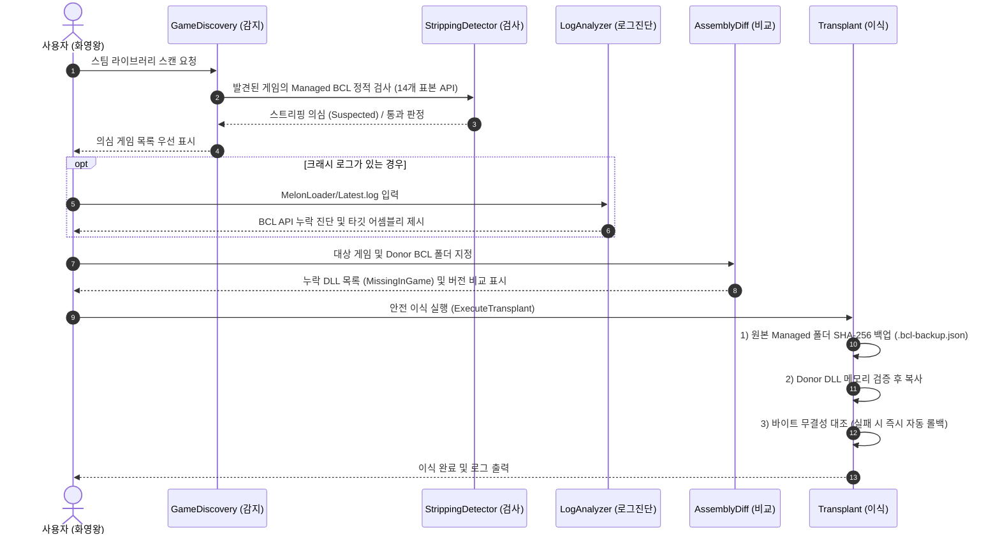

# 01. 도구 개요 및 아키텍처 (Tool Overview & Architecture)

## 1. 개요
**BCL Porting & Mod Crash Assistant**는 Unity 게임의 모딩 시 흔히 발생하는 BCL 스트리핑으로 인한 모드로더 부트스트랩 실패 및 런타임 크래시를 오프라인에서 안전하게 진단하고 치유하기 위한 전문 도구입니다.

- **핵심 철학**: 
  - 게임 바이너리를 직접 실행하지 않고 **순수 정적 분석(`Mono.Cecil`)**만으로 위험 요소를 감지합니다.
  - 파일 조작 시 항상 **SHA-256 해시 기반 무결성 검증**과 **자동 백업/원자적 롤백**을 기본 원칙으로 합니다.

---

## 2. 기술 스택 및 라이브러리

| 구성 요소 | 기술 스택 | 설명 |
|---|---|---|
| **런타임 프레임워크** | **.NET 8 (LTS)** | 고성능 파일 I/O 및 최신 C# 언어 기능 활용 |
| **UI 프레임워크** | **Avalonia UI 11** | 크로스플랫폼 XAML 데스크톱 UI, 반응형 렌더링 |
| **MVVM 패턴** | **CommunityToolkit.Mvvm** | `[ObservableProperty]`, `[RelayCommand]` 기반 클린 아키텍처 |
| **정적 분석 엔진** | **Mono.Cecil 0.11.5** | 게임 실행 없이 PE 어셈블리 메타데이터, 타입, 메서드 시그니처 분석 |
| **테스트 프레임워크** | **xUnit + Avalonia.Headless** | 비헤드리스 단위 테스트 및 UI 헤드리스 세션 테스트 지원 |

---

## 3. 솔루션 및 프로젝트 구조

```text
bcl tool app/
├── Assets/                          # UI 리소스 (아이콘 등)
├── Models/                          # 데이터 모델 계층
│   ├── AssemblyDiffItem.cs          # 어셈블리 비교 결과 항목
│   ├── BclStrippingResult.cs        # 스트리핑 검사 결과 및 열거형 상태
│   ├── CrashDiagnosisResult.cs      # 로그 진단 결과 및 크래시 분류
│   └── InstalledGame.cs             # 탐색된 게임 인스턴스 정보
├── Services/                        # 비즈니스 로직 및 코어 엔진
│   ├── BclAssemblyInspectorService.cs  # 양쪽 디렉터리 어셈블리 비교 및 심볼 검사
│   ├── BclStrippingDetectorService.cs  # 14개 표본 API 기반 BCL 스트리핑 정적 검출
│   ├── BclTransplantService.cs         # 백업 생성, SHA-256 검증 이식 및 롤백/복원
│   ├── CrashLogAnalyzerService.cs      # MelonLoader/Player.log 정규식 진단 엔진
│   └── GameDiscoveryService.cs         # Steam 라이브러리 및 Unity 게임 자동 탐색
├── ViewModels/                      # MVVM 뷰모델 계층
│   ├── AssemblyDiffViewModel.cs     # 어셈블리 비교 탭 VM
│   ├── GameDiscoveryViewModel.cs    # 스트리핑 게임 자동 감지 탭 VM
│   ├── LogAnalyzerViewModel.cs      # 크래시 로그 진단 탭 VM
│   ├── MainWindowViewModel.cs       # 탭 네비게이션 및 전체 관리자 VM
│   ├── TransplantViewModel.cs       # 안전 이식 및 복원 탭 VM
│   └── ViewModelBase.cs             # 기본 VM 베이스
├── Views/                           # Avalonia XAML 뷰 계층
│   ├── MainWindow.axaml             # 메인 윈도우 UI 정의 (4대 탭 구성)
│   └── MainWindow.axaml.cs          # 메인 윈도우 코드 비하인드
├── BclToolApp.Tests/                # 단위 테스트 프로젝트 (xUnit)
│   ├── BclStrippingDetectorTests.cs # 스트리핑 감지 엔진 검증
│   ├── BugReproTests.cs             # 실환경 재현 버그 회귀 테스트
│   ├── DiagnosticRegressionTests.cs # 로그 진단기 회귀 테스트
│   ├── GameDiscoveryTests.cs        # 스팀 라이브러리 탐색 테스트
│   └── PortingTests.cs              # 이식/백업/복원 원자성 테스트
└── docs/                            # 기술 문서
```

---

## 4. 4대 핵심 모듈 상호작용


