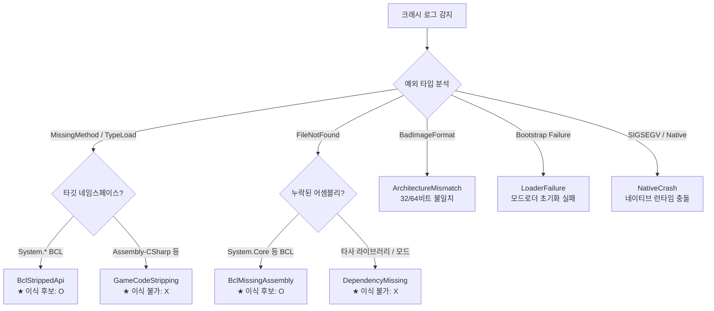

# 03. 크래시 로그 진단 패턴 (Crash Diagnosis & Patterns)

## 1. 개요
MelonLoader나 Unity 엔진 크래시 발생 시 로그 파일(`MelonLoader/Latest.log`, `Player.log` 등)을 분석하여 크래시의 근본 원인을 판정하고, **"이 문제가 BCL 이식으로 해결 가능한 문제인가?"**를 즉시 식별합니다.

---

## 2. 크래시 분류 기준 (`CrashCategory`)



---

## 3. 주요 예외 시그니처 및 정규식 분석

### 1) `MissingMethodException` (메서드 누락)
* **BCL 스트리핑 예시**:
  ```text
  [MelonLoader] [ERROR] System.MissingMethodException: Method not found: 'System.Collections.Generic.IEnumerable`1<!!0> System.Linq.Enumerable.Select(...)'
  ```
  - **진단**: `System.Linq.Enumerable`은 핵심 BCL 클래스이므로 Unity 빌더가 미사용 메서드로 판단해 제거한 상태입니다.
  - **해결책**: 정상 `System.Core.dll`을 게임의 `Managed` 폴더로 이식하면 즉시 해결됩니다.
* **게임 코드 스트리핑 예시**:
  ```text
  System.MissingMethodException: Method not found: 'PlayerController.get_Health'
  ```
  - **진단**: 게임 고유 코드(`Assembly-CSharp`)의 멤버가 누락된 경우이므로, BCL을 교체해도 해결되지 않습니다. 모드 코드 수정 또는 원본 게임 바이너리 분석이 필요합니다.

### 2) `TypeLoadException` (타입 로드 실패)
Mono 런타임 특유의 토큰 기반 오류 형식을 지원합니다:
* **표준 형식**:
  ```text
  System.TypeLoadException: Could not load type 'System.Linq.Expressions.Expression' from assembly 'System.Core, Version=4.0.0.0...'
  ```
* **Mono 토큰 형식**:
  ```text
  System.TypeLoadException: Could not resolve type with token 01000015 from typeref (expected class 'System.Linq.Expressions.Expression' in assembly 'System.Core, ...')
  ```
  - **진단**: BCL 어셈블리는 존재하지만 내부 타입 정의(Type Definition)가 통째로 삭제된 상태입니다. 이식 후보(Candidate)로 분류됩니다.

### 3) `FileNotFoundException` (어셈블리 누락)
* **BCL 어셈블리 결손**:
  ```text
  System.IO.FileNotFoundException: Could not load file or assembly 'System.Data, Version=4.0.0.0...'
  ```
  - 게임의 `Managed` 폴더에 해당 BCL 파일 자체가 배포되지 않은 경우입니다. Donor에서 해당 어셈블리를 복사하면 해결됩니다.
* **외부 종속성 결손 (BCL 대상 아님)**:
  ```text
  System.IO.FileNotFoundException: Could not load file or assembly 'Newtonsoft.Json, Version=13.0.0.0...'
  ```
  - 모드 제작자가 `UserLibs`나 모드 패키지에 동봉해야 할 서드파티 라이브러리를 누락한 경우입니다. BCL 이식 대상에서 제외됩니다.

### 4) `BadImageFormatException` (비트 불일치 또는 손상)
* 64비트 게임 프로세스에 32비트 모드 DLL을 넣었거나, 반대로 32비트 프로세스에 64비트 바이너리를 로드하려 할 때 발생합니다. 어셈블리 빌드 타깃 아키텍처(x86/x64)를 확인해야 합니다.
