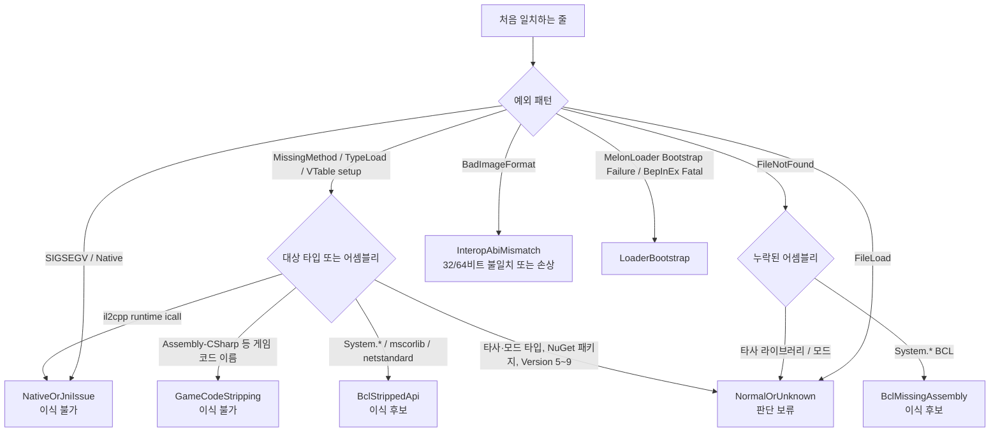

# 03. 크래시 로그 진단 패턴 (Crash Diagnosis & Patterns)

## 1. 개요
MelonLoader나 Unity 엔진 크래시 발생 시 로그 파일(`MelonLoader/Latest.log`, `Player.log` 등)을 분석하여 크래시의 근본 원인을 판정하고, **"이 문제가 BCL 이식으로 해결 가능한 문제인가?"**를 즉시 식별합니다.

---

## 2. 크래시 분류 기준 (`CrashCategory`)

로그 전체에서 **처음으로 패턴이 일치하는 줄 하나**만 보고 판정합니다. 분류 이름은 코드의 `CrashCategory` 값입니다.



* 게임 `Managed` 경로를 알면(감지 탭의 "최근 로그 분석") mscorlib 버전도 봅니다. mscorlib 2.x 게임에서 `Array.Empty` 같은 .NET 4.6+ API가 없다는 오류는 스트리핑이 아니라 프로필 차이이므로 `NormalOrUnknown`으로 바꿉니다.
* 게임 코드 여부는 이름 휴리스틱(`game`, `player`, `controller` 등 포함 여부)으로 판단하므로 틀릴 수 있습니다.

---

## 3. 주요 예외 시그니처 및 정규식 분석

### 1) `MissingMethodException` (메서드 누락)
* **BCL 스트리핑 예시**:
  ```text
  [MelonLoader] [ERROR] System.MissingMethodException: Method not found: 'System.Collections.Generic.IEnumerable`1<!!0> System.Linq.Enumerable.Select(...)'
  ```
  - **진단**: `System.Linq.Enumerable`은 핵심 BCL 클래스이므로 Unity 빌더가 미사용 메서드로 판단해 제거했을 가능성이 있습니다. 앱은 "BCL API 또는 의존성 불일치 가능성"으로 표시합니다.
  - **해결책**: 온전한 `System.Core.dll`을 이식 후보로 검토합니다. 버전 불일치일 수도 있으므로 [스트리핑 게임 감지] 탭 검사와 함께 판단하세요.
* **BepInEx 6 실측 예시**:
  ```text
  System.MissingMethodException: void System.Reflection.Module.GetPEKind(System.Reflection.PortableExecutableKinds&,System.Reflection.ImageFileMachine&)
  ```
  - 정상 mscorlib에는 반드시 있는 메서드입니다. mscorlib 스트리핑이 원인이므로 mscorlib를 포함한 이식이 필요합니다.
* **게임 코드 스트리핑 예시**:
  ```text
  System.MissingMethodException: Method not found: 'PlayerController.get_Health'
  ```
  - **진단**: 게임 고유 코드(`Assembly-CSharp`)의 멤버가 누락된 경우이므로, BCL을 교체해도 해결되지 않습니다. 모드 코드 수정 또는 원본 게임 바이너리 분석이 필요합니다.

### 2) `TypeLoadException` (타입 로드 실패)
Mono 런타임 특유의 토큰 기반 오류 형식을 지원합니다:
* **표준 형식**:
  ```text
  System.TypeLoadException: Could not load type 'System.Linq.Expressions.Expression' from assembly 'System.Core, Version=4.0.0.0...'
  ```
* **Mono 토큰 형식**:
  ```text
  System.TypeLoadException: Could not resolve type with token 01000015 from typeref (expected class 'System.Linq.Expressions.Expression' in assembly 'System.Core, ...')
  ```
  - **진단**: BCL 어셈블리는 존재하지만 내부 타입 정의(Type Definition)가 통째로 삭제된 상태입니다. 이식 후보(Candidate)로 분류됩니다.

### 3) `VTable setup of type ... failed` (MelonLoader 실측)
* **BCL 스트리핑 예시** (스트리핑된 Mono 게임, MelonLoader 0.6.6 / 0.7.3 실측):
  ```text
  System.TypeLoadException: VTable setup of type System.Reflection.DelegatingTypeInfo failed
  ```
  - **진단**: 예외에 나온 타입 자체가 없는 것이 아니라, 부모 쪽인 mscorlib의 `System.Reflection.TypeInfo`에서 가상 메서드가 잘려 VTable을 만들지 못한 것으로 보입니다(스트리핑된 원본에서는 public 메서드 17개 중 2~3개만 남아 있었음). 이식 후보(`BclStrippedApi`)로 분류하고, [스트리핑 게임 감지] 탭에서 `Module.GetPEKind`·`TypeInfo` 누락을 확인하도록 안내합니다.
  - `Could not load type of field ... due to: VTable setup of type ... failed`처럼 다른 메시지 안에 들어 있어도 인식합니다.
* **타사 라이브러리 예시** (BCL 대상 아님):
  ```text
  System.TypeLoadException: VTable setup of type Cysharp.Text.Utf16ValueStringBuilder failed
  ```
  - `System.*`이 아닌 타입은 판단 보류(`NormalOrUnknown`)로 둡니다. 게임에 번들된 서드파티 DLL(예: `ZString.dll`)이 잘린 경우일 수 있으며, 이 도구는 아직 이 경우를 따로 진단하지 않습니다.

### 4) `FileNotFoundException` (어셈블리 누락)
* **BCL 어셈블리 결손**:
  ```text
  System.IO.FileNotFoundException: Could not load file or assembly 'System.Data, Version=4.0.0.0...'
  ```
  - 게임의 `Managed` 폴더에 해당 BCL 파일 자체가 배포되지 않은 경우입니다. Donor에서 해당 어셈블리를 복사하는 것을 검토합니다. `System.Runtime.CompilerServices.Unsafe`, `System.Memory` 같은 NuGet 패키지 어셈블리와 Version 5~9 어셈블리(.NET 5~9)는 모드가 직접 동봉해야 하는 것이므로 이식 후보에서 제외합니다.
* **외부 종속성 결손 (BCL 대상 아님)**:
  ```text
  System.IO.FileNotFoundException: Could not load file or assembly 'Newtonsoft.Json, Version=13.0.0.0...'
  ```
  - 모드 제작자가 `UserLibs`나 모드 패키지에 동봉해야 할 서드파티 라이브러리를 누락한 경우입니다. BCL 이식 대상에서 제외됩니다.

### 5) `BadImageFormatException` (비트 불일치 또는 손상)
* 64비트 게임 프로세스에 32비트 모드 DLL을 넣었거나, 반대로 32비트 프로세스에 64비트 바이너리를 로드하려 할 때 발생합니다. 어셈블리 빌드 타깃 아키텍처(x86/x64)를 확인해야 합니다.
