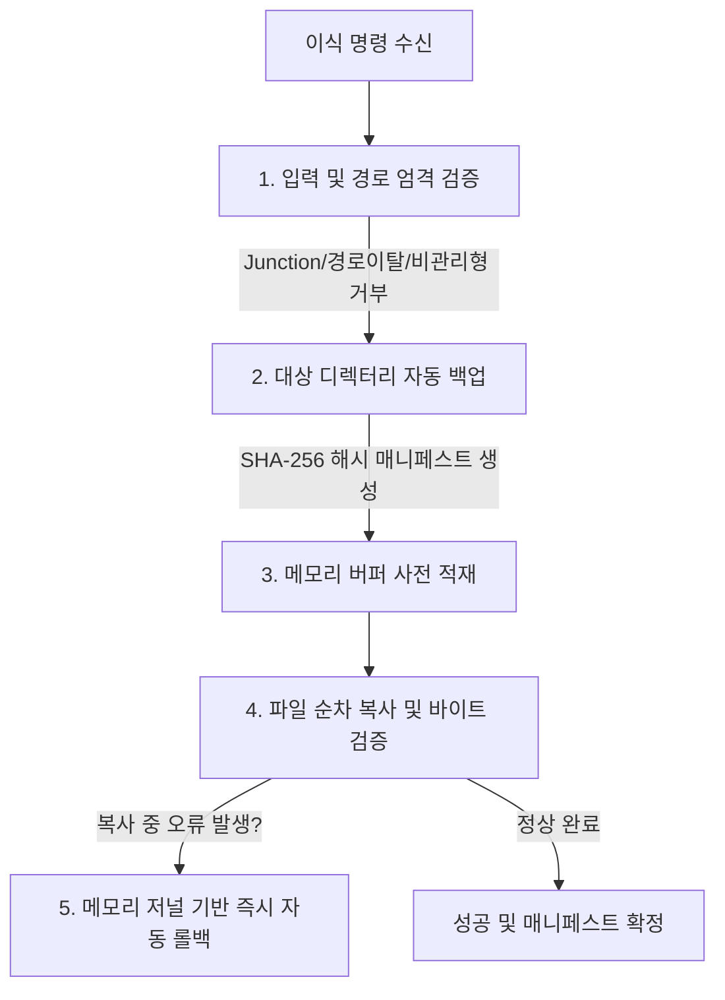

# 04. 안전 백업 및 무결성 검증 (Safety, Backup & Integrity)

## 1. 안전성 최우선 설계 원칙
게임의 `Managed` 디렉터리는 바이너리가 직접 배치되는 민감한 영역입니다. 파일 손상이나 불완전한 복사로 게임이 실행 불가능해지는 사태를 방지하기 위해 다음과 같은 5중 안전장치를 내장하고 있습니다:



---

## 2. 백업 매니페스트 (`.bcl-backup.json`) 구조

백업이 생성될 때 대상 게임 폴더의 상위 위치에 고유한 GUID를 포함한 백업 폴더가 생성됩니다:
* 폴더명 예시: `Managed_Backup_20260923_102500_a1b2c3d4e5f6...`

### 매니페스트 스키마
```json
{
  "TargetPath": "H:\\steam\\steamapps\\common\\MyGame\\MyGame_Data\\Managed",
  "Files": {
    "Assembly-CSharp.dll": "E3B0C44298FC1C149AFBF4C8996FB92427AE41E4649B934CA495991B7852B855",
    "mscorlib.dll": "8A51D14F4F3B90B26...A055",
    "System.Core.dll": "1B2C3D..."
  },
  "AddedFiles": [
    "System.Xml.dll"
  ]
}
```

* **`TargetPath`**: 백업 당시의 절대 경로를 기록하여, 다른 게임에 실수로 복원하는 것을 원천 차단합니다.
* **`Files`**: 백업 당시 존재하던 모든 원본 파일의 **SHA-256 해시**입니다. 복원 시 백업본이 손상되었는지 검증합니다.
* **`AddedFiles`**: 이번 이식 작업을 통해 **신규로 추가된 어셈블리 목록**입니다. 복원 시 원본에 없던 추가 파일만 정밀하게 삭제합니다.

---

## 3. 원자적 롤백 (Atomic Rollback) 메커니즘

파일 복사 도중 디스크 풀(Disk Full), 권한 부족, 쓰기 검증 불일치 등 예기치 않은 오류가 발생할 경우 `BclTransplantService`는 즉시 롤백 루틴을 수행합니다:

1. **사전 메모리 저널링**: 모든 복사 대상 바이트와 원본 파일의 바이트를 메모리에 먼저 보관합니다.
2. **역순 복구 (Reverse Unwind)**: 이미 디스크에 덮어쓴 파일들을 복사 역순으로 탐색하여 원래의 바이트로 재작성합니다.
3. **신규 생성 파일 제거**: 원본에 없던 신규 복사본은 디스크에서 즉시 삭제하여 불완전한 상태(Partial State)가 남지 않도록 보장합니다.

---

## 4. 파일 시스템 보안 및 보호 규칙

* **ReparsePoint (Junction / Symlink) 검증**:
  - 디렉터리 또는 파일이 심볼릭 링크나 Junction인 경우 경로 우회 쓰기를 방지하기 위해 엄격히 거부합니다.
* **경로 이탈(Path Traversal) 방지**:
  - `../`, `..\`, `C:\`, `:` 등이 포함된 비정상 파일명은 즉시 차단합니다.
* **비관리형 바이너리 차단**:
  - `Mono.Cecil`의 `AssemblyDefinition.ReadAssembly`를 통과하지 못하는 네이티브 C/C++ DLL이나 손상된 파일은 이식 대상에서 자동 배제됩니다.
