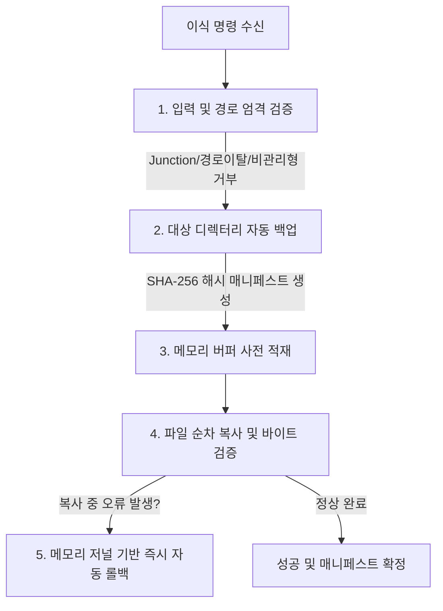

# 04. 안전 백업 및 무결성 검증 (Safety, Backup & Integrity)

## 1. 안전성 최우선 설계 원칙
게임의 `Managed` 디렉터리는 바이너리가 직접 배치되는 민감한 영역입니다. 파일 손상이나 불완전한 복사로 게임이 실행 불가능해지는 사태를 방지하기 위해 다음과 같은 5중 안전장치를 내장하고 있습니다:



---

## 2. 백업 매니페스트 (`.bcl-backup.json`) 구조

백업은 `Managed` 폴더의 상위 폴더(`<게임>_Data`)에 고유한 GUID를 포함한 이름으로 생성됩니다. `Managed` 바로 아래의 파일만 복사하며 하위 폴더는 백업하지 않습니다.
* 폴더명 예시: `Managed_Backup_20260923_102500_a1b2c3d4e5f6...`

### 매니페스트 스키마
```json
{
  "TargetPath": "H:\\steam\\steamapps\\common\\MyGame\\MyGame_Data\\Managed",
  "Files": {
    "Assembly-CSharp.dll": "E3B0C44298FC1C149AFBF4C8996FB92427AE41E4649B934CA495991B7852B855",
    "mscorlib.dll": "8A51D14F4F3B90B26...A055",
    "System.Core.dll": "1B2C3D..."
  },
  "AddedFiles": [
    "System.Xml.dll"
  ],
  "ReplacedFiles": [
    "mscorlib.dll",
    "System.Core.dll"
  ]
}
```

* **`TargetPath`**: 백업 당시의 절대 경로를 기록하여, 다른 게임에 실수로 복원하는 것을 원천 차단합니다.
* **`Files`**: 백업 당시 `Managed` 바로 아래에 있던 모든 원본 파일의 **SHA-256 해시**입니다. 복원 시 백업본이 손상되었는지 검증합니다.
* **`AddedFiles`**: 이번 이식 작업을 통해 **신규로 추가된 어셈블리 목록**입니다. 복원 시 원본에 없던 추가 파일만 정밀하게 삭제합니다.
* **`ReplacedFiles`**: 이번 이식에서 **기존 파일을 덮어쓴 목록**입니다. 복원 시 이 파일들만 백업본으로 되돌리므로, 이식 후 스팀 업데이트로 바뀐 `Assembly-CSharp.dll` 같은 다른 파일은 건드리지 않습니다.

> **알려진 문제**: `ReplacedFiles`가 비어 있으면(파일을 추가만 한 이식) 복원이 `Files`에 적힌 **모든 최상위 파일**을 백업 시점으로 되돌립니다. 이 경우 이식 후 바뀐 파일까지 덮어씁니다. [05. 알려진 문제](05-known-issues-and-improvements.md) 참고.

---

## 3. 자동 롤백 메커니즘 (앱 실행 중 오류 한정)

파일 복사 도중 디스크 풀(Disk Full), 권한 부족, 쓰기 검증 불일치 등 예기치 않은 오류가 발생할 경우 `BclTransplantService`는 즉시 롤백 루틴을 수행합니다:

1. **사전 메모리 저널링**: 모든 복사 대상 바이트와 원본 파일의 바이트를 메모리에 먼저 보관합니다.
2. **역순 복구 (Reverse Unwind)**: 이미 디스크에 덮어쓴 파일들을 복사 역순으로 탐색하여 원래의 바이트로 재작성합니다.
3. **신규 생성 파일 제거**: 원본에 없던 신규 복사본은 디스크에서 즉시 삭제하여 불완전한 상태(Partial State)가 남지 않도록 합니다.

이 롤백은 앱이 살아 있는 동안 발생한 예외에 대한 복구입니다. 복사 도중 강제 종료나 전원 차단이 일어나면 일부 파일만 바뀐 상태로 남을 수 있으며, 이 경우 백업 폴더에서 수동으로 복원해야 합니다. 롤백 자체가 실패하면 실행 기록에 "자동 롤백 실패"로 표시됩니다.

---

## 4. 파일 시스템 보안 및 보호 규칙

* **ReparsePoint (Junction / Symlink) 검증**:
  - 디렉터리 또는 파일이 심볼릭 링크나 Junction인 경우 경로 우회 쓰기를 방지하기 위해 엄격히 거부합니다.
* **경로 이탈(Path Traversal) 방지**:
  - `../`, `..\`, `C:\`, `:` 등이 포함된 비정상 파일명은 즉시 차단합니다.
* **비관리형 바이너리 차단**:
  - `Mono.Cecil`의 `AssemblyDefinition.ReadAssembly`를 통과하지 못하는 네이티브 C/C++ DLL이나 손상된 파일이 하나라도 있으면, 파일을 쓰기 전에 이식 전체를 중단합니다.
* **참조 어셈블리 차단**:
  - `ReferenceAssemblyAttribute`가 붙은 컴파일 전용 어셈블리도 같은 방식으로 이식 전체를 중단합니다.
* **파일 종류는 막지 않음**:
  - 파일명과 관리형 여부만 검사합니다. 도너 게임의 `Assembly-CSharp.dll`이나 `UnityEngine.*.dll`도 체크하면 이식되므로, BCL만 선택했는지 사용자가 확인해야 합니다.
