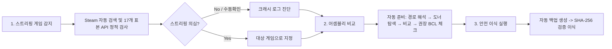

# BCL Porting & Mod Crash Assistant 기술 문서 (Documentation)

**BCL Porting & Mod Crash Assistant**는 Unity (Mono / IL2CPP) 기반 게임에서 MelonLoader 등의 모드로더 및 커스텀 모드 적용 시 발생하는 **관리형 코드 스트리핑(Managed Code Stripping)과 BCL(Base Class Library) 결손** 문제를 감지하고, 안전하게 어셈블리를 이식(Transplant) 및 복원할 수 있도록 설계된 전용 도구입니다.

---

## 📚 문서 목차 (Table of Contents)

1. [**01. 도구 개요 및 아키텍처 (Tool Overview & Architecture)**](./01-tool-overview-and-architecture.md)
   - 앱 구조 및 기술 스택 (.NET 8, Avalonia UI, Mono.Cecil)
   - 4대 핵심 모듈 (감지, 진단, 비교, 이식) 상세 설계
2. [**02. 멜론로더 BCL 스트리핑 가이드 (MelonLoader BCL Stripping Guide)**](./02-melonloader-bcl-stripping-guide.md)
   - Unity Managed Code Stripping 원리
   - MelonLoader 부트스트랩 및 모드 로딩 시 BCL 결손 메커니즘
   - Donor BCL 선택 기준 및 안전한 이식 실무 워크플로우
3. [**03. 크래시 로그 진단 패턴 (Crash Diagnosis & Patterns)**](./03-crash-diagnosis-and-patterns.md)
   - `MissingMethodException`, `TypeLoadException`, `FileNotFoundException` 판정 기준
   - BCL 누락 vs 게임 자체 코드(Assembly-CSharp) 스트리핑 구분법
   - MelonLoader 최신 로그 패턴 및 네이티브 크래시 처리
4. [**04. 안전 백업 및 무결성 검증 (Safety, Backup & Integrity)**](./04-safety-backup-and-integrity.md)
   - `.bcl-backup.json` 매니페스트 구조
   - SHA-256 해시 검증 및 디스크 링크(Junction/Symlink) 보호
   - 이식 실패 시 자동 롤백 및 원상 복구 메커니즘
5. [**05. 알려진 문제 및 개선 로드맵 (Known Issues & Roadmap)**](./05-known-issues-and-improvements.md)
   - 해결된 재현 테스트 10건과 2026-09-24 점검에서 찾은 남은 문제
   - 비동기 I/O 전환, FolderPicker UI, 다중 백업 관리자 등 개선 로드맵

---

## ⚡ 빠른 시작 (Quick Start)

### 빌드 및 테스트
```powershell
# 단위 테스트 실행 (Avalonia 제품 통계 예외 방지 옵션 포함)
dotnet test BclToolApp.sln --no-restore -p:UsedAvaloniaProducts= -v:minimal

# 릴리즈 빌드 실행
dotnet run --project BclToolApp.csproj -c Release
```

### 기본 권장 워크플로우

